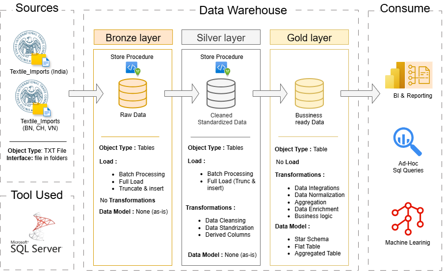
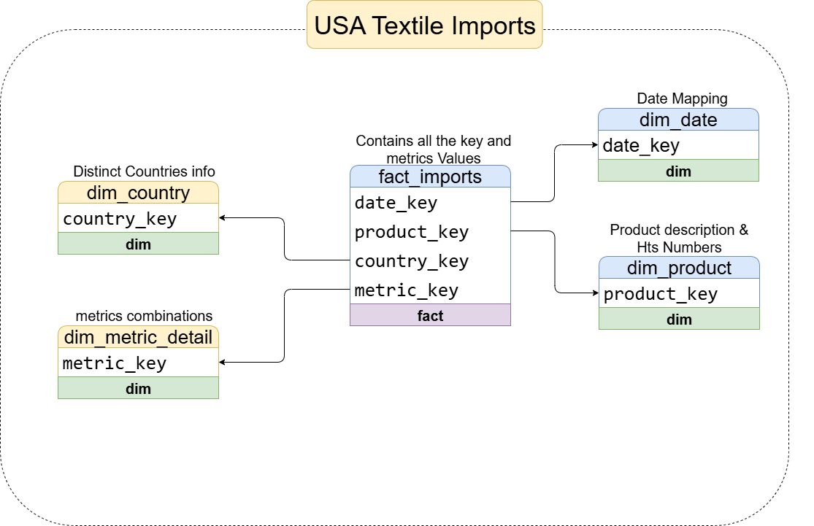
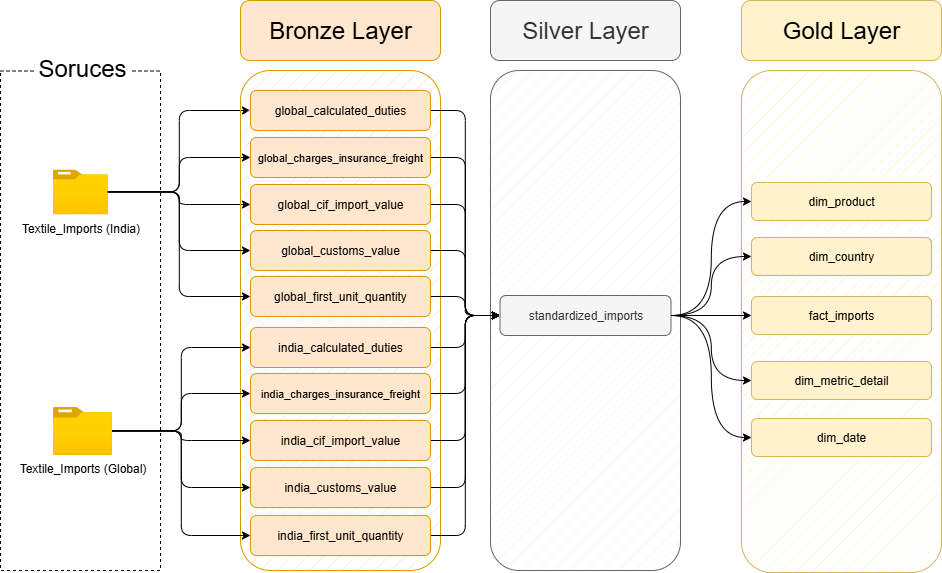
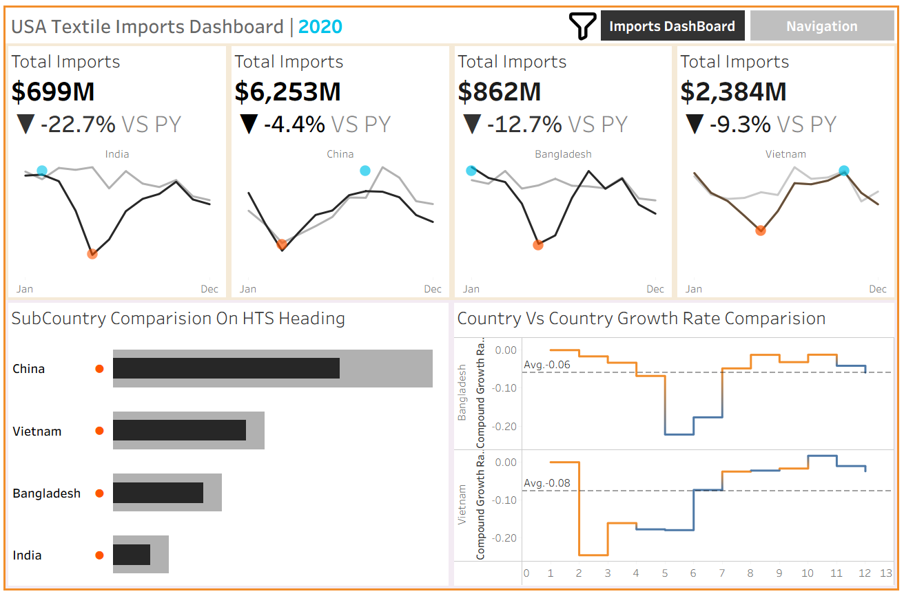

# USA Textile Imports: A Data Warehouse & Seasonality Analysis Project

This project demonstrates a complete, end-to-end data warehousing solution, from ingesting and transforming raw import data to generating actionable dashboards.

---
## 🏗️ Data Architecture

The project architecture follows the modern **Medallion Architecture** pattern, with distinct **Bronze**, **Silver**, and **Gold** layers built within a SQL Server data warehouse. This structure ensures data quality, traceability, and high performance for analytical queries.

1.  **Bronze Layer**: Ingests and stores raw, wide-format data as-is from the source text files.
2.  **Silver Layer**: Consolidates, cleanses, and standardizes the data into a single, unified atomic table.
3.  **Gold Layer**: Houses the final, business-ready data modeled into a Star Schema for reporting and analytics in Tableau.
---
## 📊 Data Overview

This project analyzes textile import data for **four key countries** into the USA:
* 🇮🇳 **India**
* 🇨🇳 **China**
* 🇻🇳 **Vietnam**
* 🇧🇩 **Bangladesh**

The dataset includes monthly totals (from 2018 to 2025) for every product across **five distinct metrics**:

1.  **CIF Import Value:** The total monetary value of imported goods, including Cost, Insurance, and Freight. (Unit: US Dollars)
2.  **First Unit of Quantity:** The primary physical measure of the imported goods (e.g., kilograms, dozens, square meters). Represents import volume.
3.  **Calculated Duties:** The amount of tariffs/taxes paid on the imported goods. (Unit: US Dollars)
4.  **Customs Value:** The value of goods declared to customs, used for duty calculation. (Unit: US Dollars)
5.  **Charges, Insurance & Freight (CIF Breakdown):** The specific costs associated with shipping and insuring the goods. (Unit: US Dollars)

---

## 📖 Project Overview

This project involves:

1.  **Data Architecture**: Designing a robust data warehouse using the Medallion (Bronze, Silver, Gold) pattern.
2.  **ETL Pipelines**: Developing T-SQL stored procedures to extract, transform, and load data between layers.
3.  **Data Modeling**: Building a dimensional model (Star Schema) with fact and dimension tables optimized for analytical queries.
4.  **Analytics & Reporting**: Creating interactive Tableau dashboards to uncover seasonal trends and key business insights.

🎯 In short whole project revolves around in:
- SQL Development & T-SQL
- Data Architecture & Engineering
- ETL Pipeline Development
- Dimensional Data Modeling (Star Schema)
- Business Intelligence & Data Analysis

---

## 🛠️ Tools Used

- **Database**: SQL Server Express
- **ETL/Transformation**: SQL Server Management Studio (SSMS) & T-SQL
- **Data Export**: `bcp` Command-Line Utility
- **BI & Visualization**: Tableau Public
- **Diagrams**: Draw.io
- **Version Control**: Git & GitHub

---

## 🚀 Project Requirements

### Building the Data Warehouse (Data Engineering)

#### Objective
Develop a modern data warehouse using SQL Server to consolidate textile import data from multiple source files, enabling powerful seasonal analysis and strategic decision-making.

#### Specifications
- **Data Sources**: Import data from 10 source `.txt` files, representing 5 metrics for India and a global region (China, Vietnam, Bangladesh).
- **Data Quality**: Cleanse raw data by handling inconsistent formatting, filtering non-events (zero values), and standardizing text fields.
- **Integration**: Combine all sources into a single, user-friendly star schema data model designed for high-performance analytical queries.
- **Scope**: The data covers the period from 2018 to 2025. Historization of data is not required (full truncate/reload).
- **Documentation**: Provide clear diagrams and documentation for the data model and ETL flows.

---
## 📊 BI: Analytics & Reporting (Data Analysis)

#### Objective
Develop Tableau-based analytics to deliver detailed insights into:
- **Seasonal Import Trends**
- **Country Performance & Comparison**
- **Product Category Analysis**

These insights empower stakeholders with key business metrics to understand demand cycles and optimize supply chain strategies.

## 📈 Key Diagrams

### Data Integration Model
This diagram shows the flow of data through the Bronze, Silver, and Gold layers, from raw files to the final data mart.

### Data Lineage Diagram
This diagram details the transformations that occur as data moves between layers, showing how columns are derived, cleansed, and standardized.

## 🎨 Dashboard & Visualizations
An interactive dashboard was created in Tableau to explore the data, answer the core business questions, and allow for dynamic filtering.

### Import Analysis Dashboard
This dashboard provides a comprehensive overview of import performance. It features high-level KPIs with Year-over-Year comparisons, a main seasonality trend chart, and interactive breakdowns by country and product category.

## 🛡️ License

This project is licensed under the [MIT License](LICENSE). You are free to use, modify, and share this project with proper attribution.

